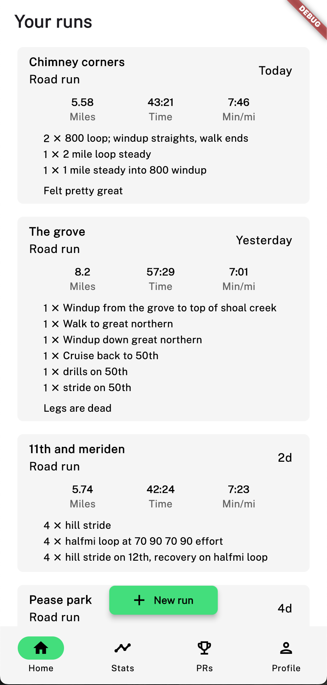
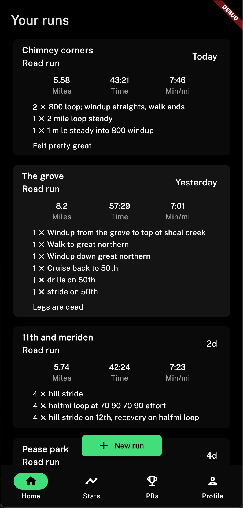
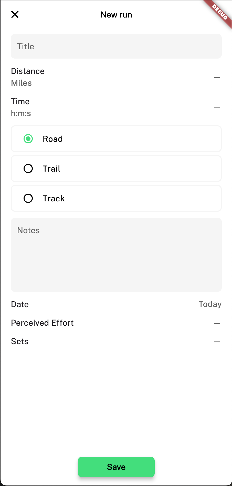
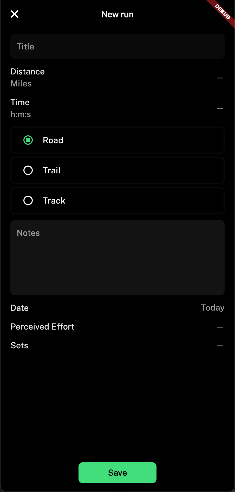
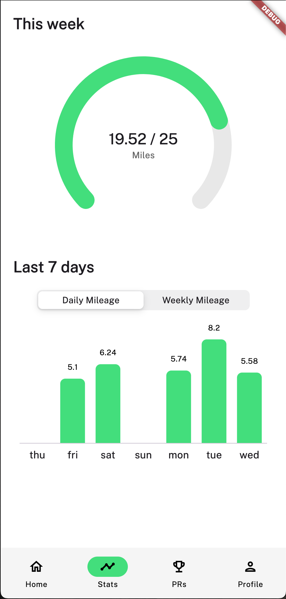
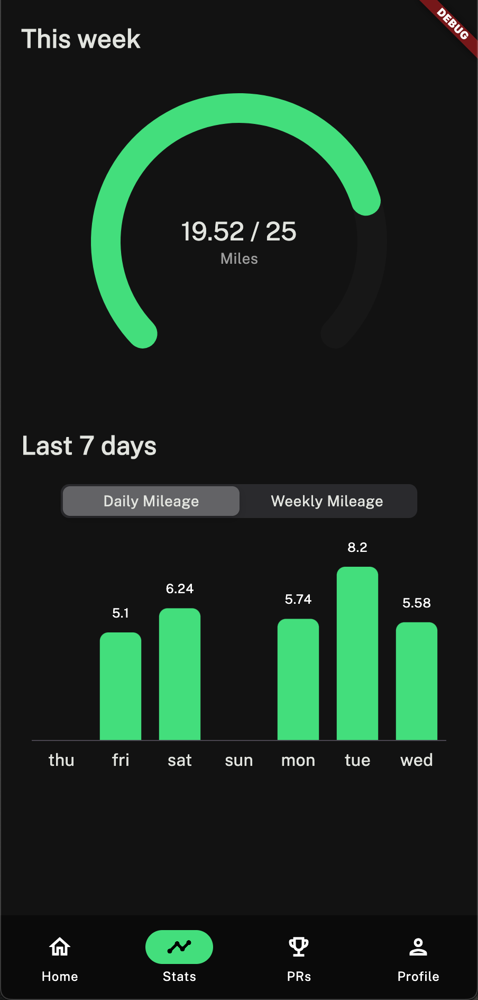
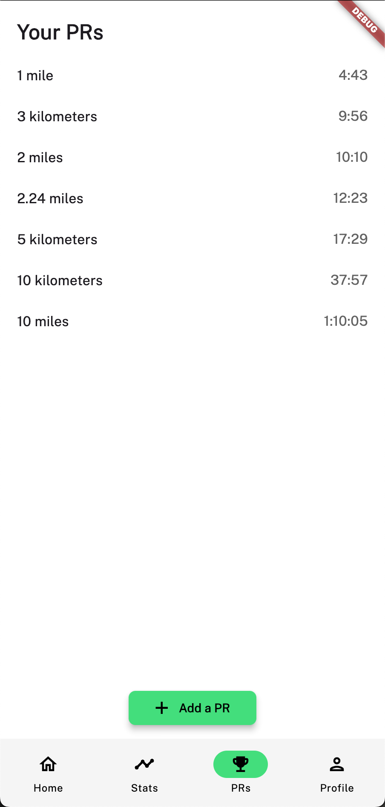
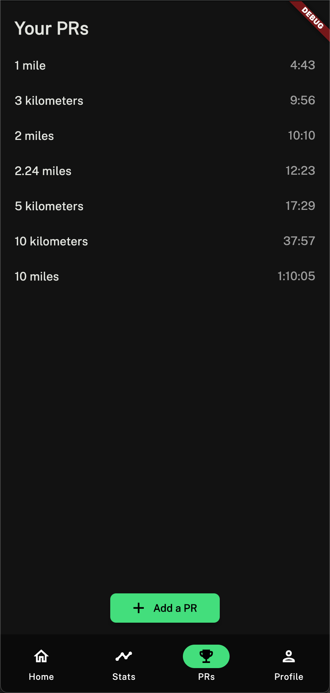
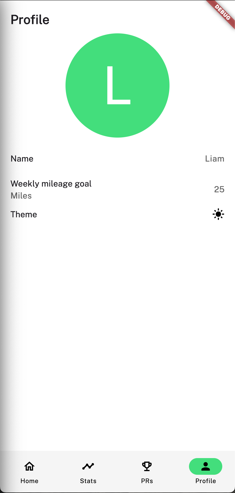
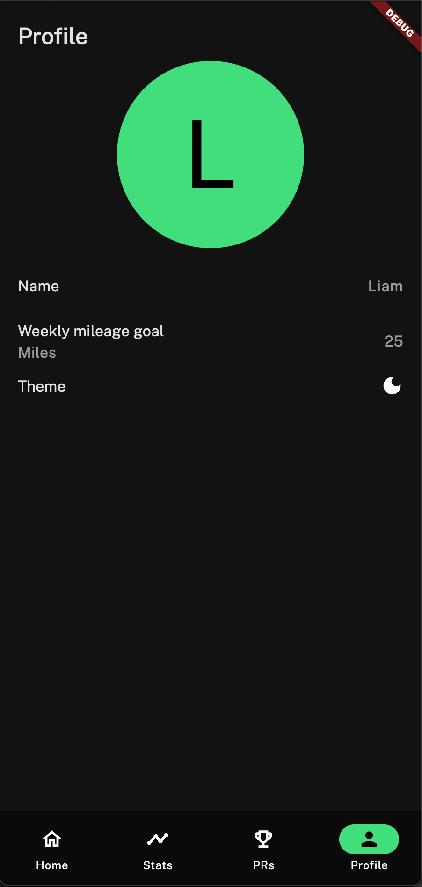

# Rundex

A simple running log to track mileage. Allows you to enter your run information such as a title, distance, time, surface, date, perceived effort, sets, and notes. Also includes a stats page to view mileage charts and a PR tracker page.

## For the future
 - [ ] Add weather
 - [ ] Add starter survey

## Screenshots
(slightly outdated)

Home page

Add run page

Stats page

PR page

Profile page

